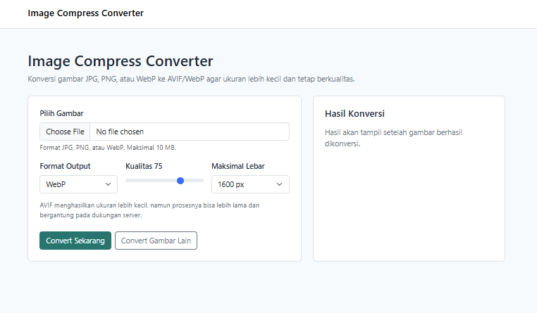
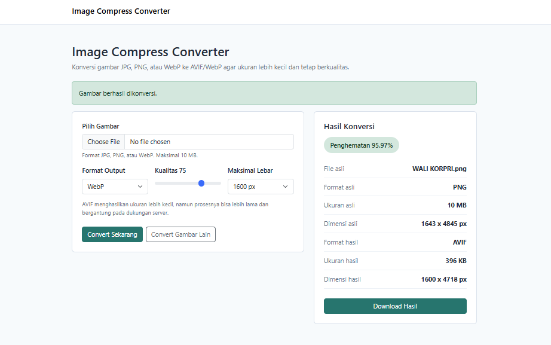

# Image Compress Converter

Image Compress Converter adalah aplikasi web Laravel sederhana untuk mengunggah
gambar JPG, JPEG, PNG, atau WebP, lalu mengonversinya menjadi WebP atau AVIF
dengan ukuran file lebih kecil.

## Fitur Utama

- Upload satu gambar dengan batas ukuran 10 MB.
- Preview gambar sebelum konversi.
- Konversi output ke WebP atau AVIF jika didukung server.
- Pengaturan kualitas kompresi dari 10 sampai 100.
- Resize otomatis dengan pilihan maksimal lebar 800, 1200, 1600, 1920, atau original.
- Informasi ukuran, dimensi, format, dan persentase penghematan.
- Download hasil konversi.
- Command pembersihan file hasil konversi sementara.

## Requirement Server

- PHP 8.2 atau lebih baru.
- Composer.
- Ekstensi PHP untuk pemrosesan gambar, misalnya GD atau Imagick.
- Ekstensi WebP untuk output WebP.
- Ekstensi AVIF untuk output AVIF jika ingin mengaktifkan format AVIF.

## Instalasi Lokal

```bash
composer install
cp .env.example .env
php artisan key:generate
php artisan storage:link
php artisan serve
```

Buka aplikasi di:

```text
http://127.0.0.1:8000
```

## Menjalankan Test

```bash
php artisan test
```

## Pembersihan File Sementara

Hasil konversi disimpan di:

```text
storage/app/public/conversions
```

Hapus file yang lebih lama dari 24 jam:

```bash
php artisan conversions:clear
```

Contoh cron harian:

```bash
0 1 * * * php /path/to/project/artisan conversions:clear
```

## Catatan AVIF

Opsi AVIF otomatis dinonaktifkan di UI jika server belum mendukung encoding
AVIF. Jika pengguna tetap mengirim request AVIF saat server tidak mendukung,
aplikasi akan menampilkan pesan error tanpa menyebabkan error 500.

## Screenshot



